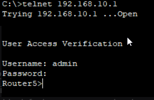

## AAA Server Configuration

We decided to use a dedicated server for AAA services. The server will be running RADIUS and Tacacs+.

 The server will be configured to provide centralized authentication, authorization, and accounting services for the network.

It has the following configuration:

 - **IP Address**:`192.168.10.12`
 - **Subnet Mask**:`255.255.255.0`
 - **Default Gateway**:`192.168.10.1`

 ## To this server, we will install and configure the following:
 - **RADIUS**:
   - **IP Address**:` 192.168.10.1  `
   - **Port**:`1812`
   - **Shared Secret Key**:`cisco123`
- **Tacacs+**:
   - **IP Address**:`192.168.10.1`
   - **Port**:`49`
   - **Shared Secret Key**:`cisco456`


Next we assign usernames and passwords to the users in the network.

### Router Configuration for AAA.

**Router Configuration for RADIUS**:

```bash
Router(config)#aaa new-model
Router(config)#radius-server host 192.168.10.12 auth-port 1812 
Router(config)#radius-server key cisco123
Router(config)#aaa authentication login default group radius local
Router(config)#aaa authorization exec default group radius local
Router(config)#aaa accounting exec default start-stop group radius
```

**Router Configuration for Tacacs+**:

```bash
Router(config)#tacacs-server host 192.168.10.12 auth-port 49 
Router(config)#tacacs-server key cisco456
Router(config)#aaa authentication login default group tacacs+ local
Router(config)#aaa authorization exec default group tacacs+ local
Router(config)#aaa accounting exec default start-stop group tacacs+
```

After setting up our network devices to use the AAA server, we tested the configuration by logging into the network devices using the usernames and passwords assigned.

For demonstration purposes, we used the following usernames and passwords:
`'admin' with password 'admin'`

### And sure enough `admin` was able to log in successfully.

   
