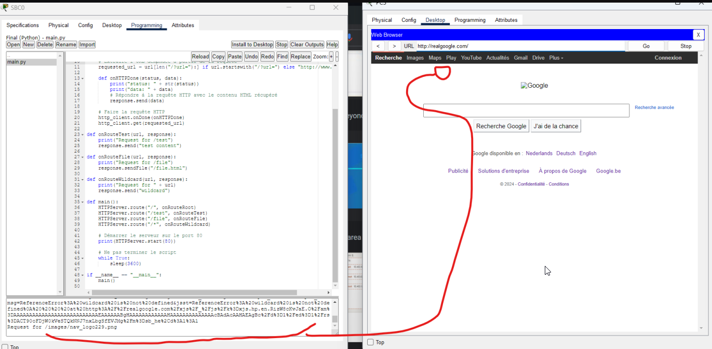
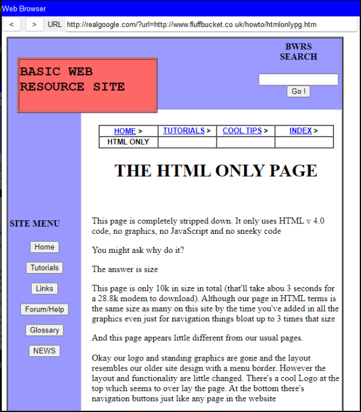

# Cloud - The Internet Simulation

Our network wouldn't be complete without the internet. We've got a Cloud-PT device to simulate the internet connection.

Here's how we set it up:

### Cloud-PT Cloud2

- **Purpose**: Simulates the Internet environment for the internal network.
- **IP Address Assignment**:
  - Each cloud port is configured with an appropriate IP address that matches the subnet of the connecting router interface.

### Traffic Flow

- The Cloud-PT directs traffic from the internal network to the simulated Internet and vice versa.
- Proper routing must be configured on each router to ensure packets can reach the Cloud-PT and that return traffic can find its way back to the correct internal network.

And here we have a surprise for you! The internet is a vast place, and we've got a little something extra to show you. Teddy cue~

