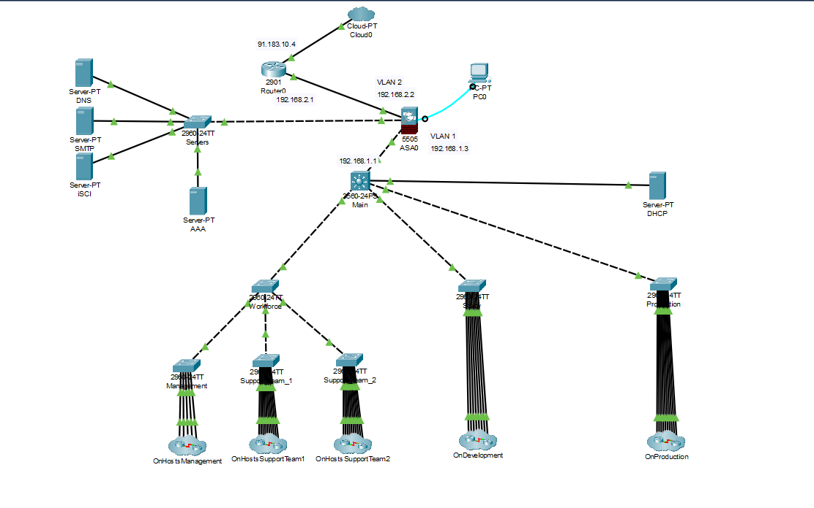

# DMZ Setup

In addition to the basic network setup, we also tried to set up a DMZ on the ASA firewall.



The DMZ was supposed to be a separate network that would host the servers.
Unfortunatelly we run into some issues with the ASA firewall and the DMZ setup was not fully functional. 

### DMZ setup

Setting up the dmz on ASA

Extract from the conversation : 

``` 
I set up the vlan by giving it an ip and assigning it to a physical interface so far so good, I had to no forward one of my other vlans to allow this by the way they wouldn't accept a third nameif as long as i didn't do a no forward to one of my other vlans.

Anyways I gave the dmz a dhcp pool so that I don't have to try and get the ips from the "inside network". But it didn't work so I checked why and it said "Ethernet 0/2 is blocked by STP" so i looked on the internet and they said it's becaue I need to change the switchport mode to trunk (I had previously configured it as access) but now I get this error: "trunk port mode is not supported with this license". 

So I've decided I'm gonna drop the dhcp pool and try to still get it from the inside network.
```

### Current state of the dmz 

Within the DMS_trouble package, the ASA firewall is configured as follows:

- Status =  `up`
- IP `192.168.10.1` (the default gateway of vlan 10) 
- Is linked to interface Ethernet 0/2
- Nameif dmz works, but had to sacrifice by doing: no forward vlan 1 (the inside interface i.e. Ethernet 0/1)

### Problems to solve with the dmz
- Forward back to vlan 1 / find a way to have more than 2 interfaces forwarding to each other.
- Get the OG dhcp server to work all the way to the dmz / find some way to give the servers ip addresses
