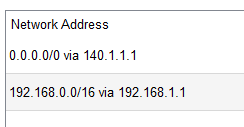
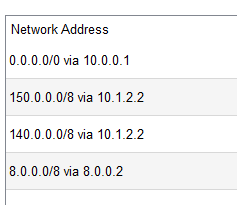
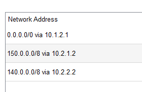
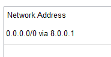
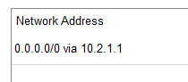
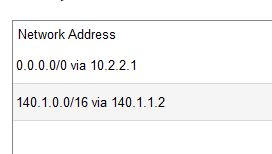

# Routers 

In total we have a broderhood os several types of routers: `Cisco 1941` routers and  `Cisco 2911` router.

### Configuration

1.  `Router5 2911` - The Networking Nomad
  This is the one that struts through the digital world, wearing multiple hats. 
    -  `GigabitEthernet0/0` is the bridge to the ISP's router. Think of it as the outgoing friend with an IP address of `140.1.1.2` who knows all the secrets of the **World Wide Web**.
    -  `GigabitEthernet0/1` is the local buddy, hanging out with the internal network, sporting an IP address `192.168.10.1.`
    - `GigabitEthernet0/2`, the cool security guard with an IP address of `192.168.2.1`, stands watch over the DMZ (DeMilitarized Zone), the VIP section of our digital club.
    - It has the following routing table:

      

1.  `IntermediateRouter0` - The Middle Manager
It's the central hub that routes packets like a pro. Picture it as a traffic cop standing between the Cloud and ISPAdminstrator, guiding data along the network pathways.
      - `FastEthernet0/0` interface wears an IP badge of `10.1.2`
      - `FastEthernet0/1` sports a `8.0.0` badge, ensuring that everything in its digital dominion runs smoothly.
 
     -  It has the following routing table:
  
           

3. `IntermediateRouter1` - The Diplomat
This router is the network's ambassador to the ISPControlled land. 
   - `FastEthernet0/0` conncects with `IntermediateRouter0` at `10.2.1` 
   - `FastEthernet0/1` connects with `Router5` at `10.2.2.` It's the savvy negotiator that makes sure the data flows without any diplomatic incidents.
   - It has the following routing table:
  
       

4. `ISP's Routers` - The Gatekeepers
These are the keepers of the Internet realms, with IP addresses like `8.8.8` and `10.0.0`  They decide who gets to cross the bridge into the vast online territories and who doesn't. 

      - And the following routing table :
    
        

5. `The "ISPAdminstrator"` - The Mayor's Hotline
This one's like the mayor's hotline, connecting the ISP directly to the administrative side.
    - `GigabitEthernet0/0`: With IP `150.1.1.2`, always open for `IntermediateRouter1` to call.
    - It has the following routing table:
  
       

6. `The "ISPControlled"` - The Mayor's Hotline
   This one's like the mayor's hotline, connecting the ISP directly to the controlled side.
    - `GigabitEthernet0/0`: With IP `
    - It has the following routing table:
      