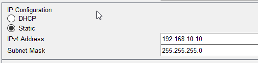
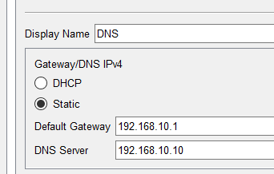

#DNS Server Configuration

## DNS Server Configuration

The DNS server is a crucial part of the network infrastructure. It translates domain names into IP addresses, allowing users to access websites and services by name rather than numerical IP addresses.

### Server Details

- **Server Name**: DNS
- **IP Address**: `200.200.10.10`
- **Subnet Mask**:`255.255.255.0`
  

