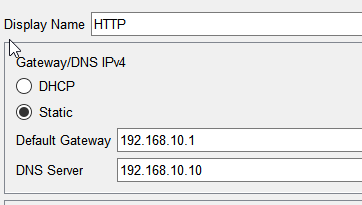

# HTTP Server

The HTTP server is located within the DMZ (Demilitarized Zone) with the IP address `192.168.10.11`. It is accessible from the internal network as well as from the Internet, allowing for web services to be hosted securely.

## Server Details

- **IP Address:** `200.200.10.11`
- **Subnet Mask:** `255.255.255.0`
- **Default Gateway:** `200.200.10.1`
- **DNS Server:** `200.200.10.10`

## Configuration

The server's network settings are statically assigned to ensure consistent accessibility and operation within the DMZ.

```plaintext
Display Name: HTTP
Default Gateway: 200.200.10.1
DNS Server: 200.200.10.10
IPv4 Address: 200.200.10.11
Subnet Mask: 255.255.255.0
```

## Services
- **HTTP Service:** Enabled
- **HTTPS Service:** Optional (Enabled based on security requirements; not shown in current configuration)

## Hosted Content

The server hosts a number of web pages and resources:

- `copyrights.html`: Contains the copyright declaration for the hosted content.
- `cscoplogo177x111.jpg`: An image file included in web pages.
- `helloworld.html`: A simple HTML file to test the web service functionality.
- `image.html`: A web page dedicated to displaying images.
- `index.html`: The default landing page for site visitors.


    
    
