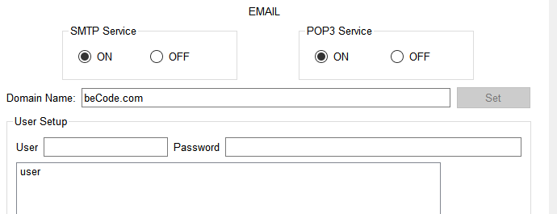

# STMD Server 

The STMD server is a critical component of the network infrastructure, providing a variety of services to support the organization's operations.

The standard configuration and details of the STMD server:

- **Access Controls:** Standard user access controls are applied.
