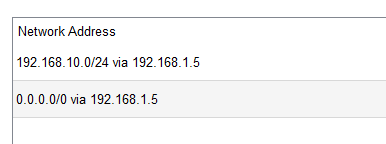

# Switches

Our network is a thing of beauty. There's a sketch below that shows all the connections, kind of like a family tree but for computers.

We used the following switches in our network:

- `Multilayer Switch -3560-24PS ` 
   -   The switch that makes it all happen (and sometimes not happen).
    

     - it has the following routing table:
   - 
     

- Multiple `2962-24TT` switches - to connect the different departments to the network.
  
     