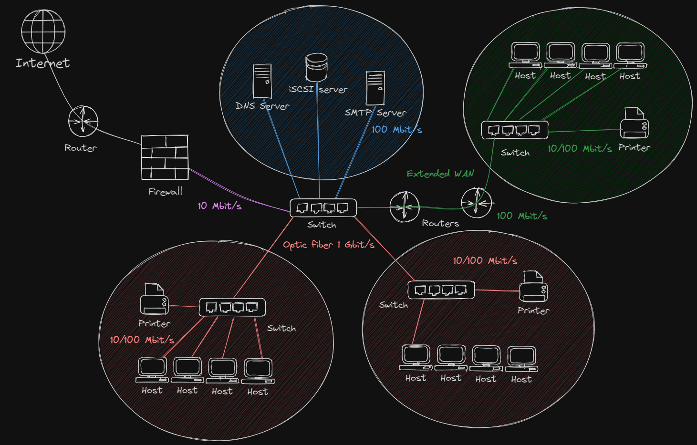
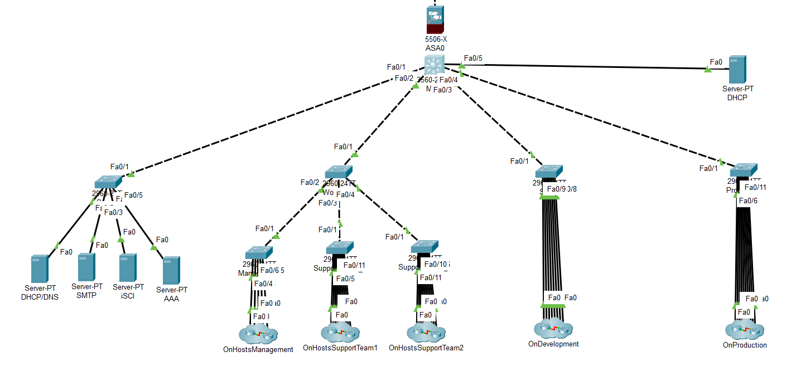
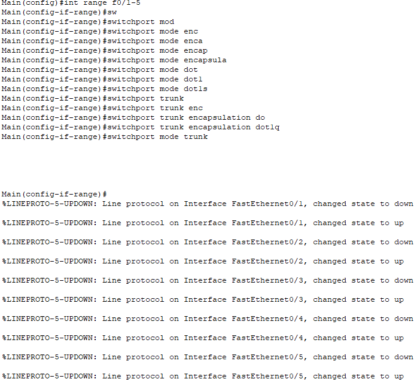
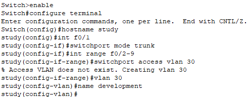
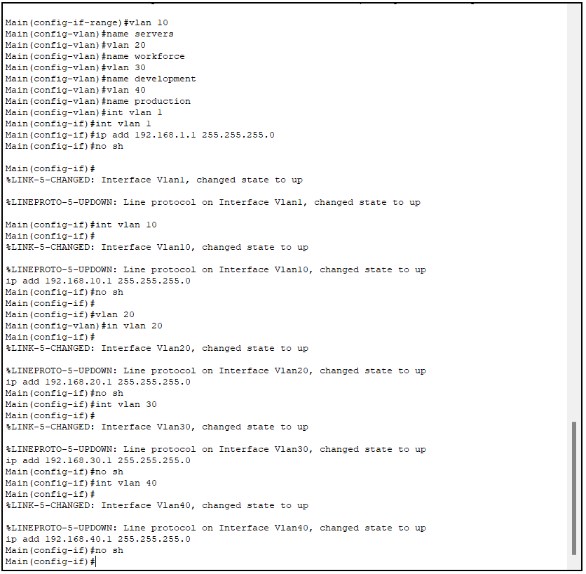
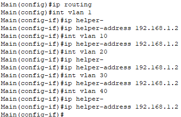

# Secure Network Design Project – No Nonsense Network Know-How

## So, What's the Big Idea?

Hey there! You've stumbled upon our humble abode where we’re busy crafting a network that's secure enough to make Fort Knox envious. This isn't just any network; it’s a modern marvel that balances cost with a fortress-level security stance.

### Team Effort

3 brainiacs/group: 
- Teddy 
- Esaü 
- Flo

## The Lowdown on Our Project

We’ve got a mission: to yank a client’s office into the 21st century by networking the heck out of it.
 
 We’re talking about a setup that screams efficiency(!), oozes security(!!!), and doesn’t break the bank (...too much ).

## Here's How We Roll
- **Simulate to Dominate:** Using Cisco Packet Tracer to get a bird's-eye view of our handiwork.
- **Documentation Domination:** Writing up stuff so well, it'll be crystal years from now.
- **Security Obsession:** We're basically digital ninjas keeping the bad guys at bay.
- **Show and Tell:** We’ll explain our moves so even our grannies would get it.

## The Game plan : 
- **Network Not-So-Trivial Pursuit:** Does our Packet Tracer simulation actually work? You betcha. 
    - **The Blueprint (Packet Tracer File):** Check out our .pkt to see how we roll.
   - **The Big Picture:** Are we seeing the forest for the trees?

- **Fortress Foundations:** Did we go all medieval with the security? Like a digital moat.

## The Nuts and Bolts (But Mostly Wires)
Our network’s a thing of beauty. There's a sketch below that shows all the connections, kind of like a family tree but for computers.

### The Setup
Our setup’s got more layers than a lasagna. We’ve got servers doing server things, a firewall that's hotter than a summer barbecue, and switches that... well, switch.

### The Plot (Sector Breakdown)
- **Management/Secretariat:** 5 desks where the magic happens.
- **Study:** 8 desks for scholarly pursuits.
- **Production:** 10 desks for making dreams come true.
- **Support:** 20 desks, divided by two, for saying "Have you tried turning it off and on again?"

### IP Sitch and VLAN Vibes
  **IP Addressing:** We've got a plan for every IP.
- **Router0:** The big cheese, with an IP of `
- **Switch0:** The switch that makes it all happen  
  

- **Servers:** DNS, SMTP, and iSCSI servers with IPs of `
- **Cloud-PT:** Our internet simulation, with an IP of `
  

**VLANs:** We've got VLANs for days, each with its own purpose.

    Each VLAN has its own subnet, and we've got a plan for every IP.

- **VLAN 10:** The Servers. Where the internet meets the network.
- **VLAN 20:** The cool kids' table. Management and Support.
- **VLAN 30:** Where Study get stuff done.
- **VLAN 40:** Production's playground.

### Security (aka The Bouncer)
This was quite a treat! We've got security measures that are tighter than a drum, and because Cisco Packet Tracer is our long-time friend (and sometimes foe), we've tried the inplementation of a firewall that turned up to be a bit of a diva. As such we had to take a step back and re-evaluate our approach.

 Why? Because we can only simmulate and not recreate and simmulation happens matrix style - `we can't just bend the rules of the matrix, we have to play by them.`

 Our pick of choice for the firewall was the Cisco ASA 5505, but we had to make do with the Cisco NR router.
 To this we implemented the following security measures:
- **RADIUS and TACACS + :** It's like the club's VIP list, but for network access.
 
 

## The Fine Print
- **DMZ Drama:** Our firewall's being a diva and only lets us use two VLANs.
- **Switcheroo:** Switches that don’t switch like they’re supposed to.
- **Versions Limbo:** We hit a version released snag, but we’re crafty and we’ll figure it out.

## The Grand Finale
We’re not done yet! We’ve got a few more tricks up our sleeves before we call it a day.

## Shout-Outs
- Props to BeCode for throwing down the gauntlet.
- High-fives to all our brainy teammates~